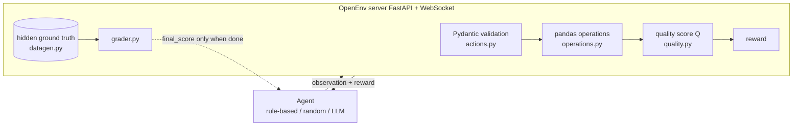

# OpenEnv Data Cleaning Environment

An [OpenEnv](https://github.com/meta-pytorch/OpenEnv) environment where an agent cleans a dirty pandas table one
action at a time, plus baselines, a benchmark, an LLM agent and a Gradio demo.

- **Reproducible:** every episode is `(task_id, seed)` -> the same dirty table, with a hidden clean ground truth.
- **Honest scoring:** the training-style *reward* and the final *grader score* are separate things (see below).
- **Agents included:** do-nothing, random, a rule-based heuristic, and a zero-shot LLM agent (Llama 3 8B through the
  Hugging Face router). **Nothing here is trained** - the LLM agent is prompting only. See the roadmap for RL training.

> The Hugging Face Space linked from older versions of this README runs the pre-v2 code until it is redeployed
> (see [Deploy](#deploy-to-hugging-face-spaces)).

## How it works



Episode: `reset(task_id, seed)` -> repeat `step(action)` -> `finish` (or the step budget runs out).

### Tasks

| Task | Rows | Step budget | What is wrong with the data |
|---|---|---|---|
| `easy-clean` | 40 | 15 | missing values in `age` |
| `medium-clean` | 60 (+duplicates) | 25 | missing values (numeric + categorical) and exact duplicate rows |
| `hard-clean` | 100 (+duplicates) | 45 | all of the above plus inconsistent categories (`NY`, `new york`, `New York `), numbers stored as text (`"25"`), `N/A` placeholders, impossible values (age 999), mixed date formats, stray whitespace |

The table is a synthetic customers table: `customer_id, name, age, city, signup_date, plan, monthly_spend`.

### Actions

| `action_type` | Fields | Effect |
|---|---|---|
| `fill_missing` | `column_name`, `strategy` (`mean`/`median`/`mode`/`constant`), `value` (constant only) | fill nulls |
| `drop_duplicates` | - | remove exact duplicate rows |
| `standardize_categories` | `column_name`, optional `mapping` | fix case/spacing; map aliases like `NY -> New York` |
| `cast_type` | `column_name`, `target_type` (`int`/`float`/`str`) | convert text to numbers (placeholders become nulls) |
| `strip_whitespace` | optional `column_name` | trim and collapse spaces |
| `fix_dates` | `column_name` | normalise mixed formats to `YYYY-MM-DD` |
| `clip_outliers` | `column_name` | clip to the column's valid range |
| `drop_rows_with_missing` | optional `column_name` | drop rows with nulls (penalised: loses data) |
| `finish` | - | end the episode |

Invalid actions (unknown column, `mean` on text, a string constant in a numeric column, ...) are **not applied**; the
agent receives an explanation in `last_error` and a small penalty.

### Observation

`task_id, seed, row_count, duplicate_count, total_missing, step_count, steps_remaining, quality_score, total_reward,
invalid_action_count, last_action, last_action_ok, last_message, last_error, data_sample` (first 5 rows) and one
**column profile** per column: `dtype, expected_type, missing, unique, sample_values, issues` (e.g.
`{"missing": 5, "whitespace": 3}`), `allowed_values`, `bad_values`, `valid_range`. The expected types, allowed
category values and valid ranges are part of the task description, like constraints in a database schema.
`final_score` and `score_breakdown` are `null` until the episode is over.

### Reward

`Q` is an observable quality score: `Q = 1 - (schema violations + duplicate_rows * n_columns) / (initial_rows * n_columns)`.

```
reward = 10 * (Q_now - Q_before)          progress (potential-based shaping)
       - 0.02                             every step
       - 0.05  if the action changed nothing
       - 0.10  if the action was invalid
       - 0.30  per ground-truth row destroyed
       + on `finish` only: +1.0 if Q = 1, otherwise -2.0 * (1 - Q)
```

The progress terms add up to `10 * (Q_end - Q_start)`, so repeating actions or going in circles cannot earn reward
(there is a test for this). `observation.reward` is the reward of the last step only; `total_reward` is the sum.

### Grader (separate from the reward)

`score = 0.6 * cell_accuracy + 0.2 * row_fidelity + 0.2 * schema_score`, in [0, 1], computed against the hidden
ground truth and revealed only in the final observation. Numeric cells earn partial credit by closeness (an imputed
value is never exactly right); a table identical to the ground truth scores exactly 1.0. Because imputation is
approximate, the best realistic score is below 1.0 even when `Q` reaches 1.0.

## Benchmark

Mean grader score +- std over 10 seeds per task, in-process, from `python benchmark.py` (raw per-episode data in
[docs/benchmarks/](docs/benchmarks/)):

| Agent | easy-clean | medium-clean | hard-clean | Invalid-action rate |
|---|---|---|---|---|
| do-nothing (finish immediately) | 0.954 | 0.862 | 0.608 | 0% |
| random | 0.871 ± 0.079 | 0.766 ± 0.073 | 0.534 ± 0.058 | 27-31% |
| rule-based | **0.987 ± 0.001** | **0.980 ± 0.003** | **0.968 ± 0.003** | 0% |
| LLM (Llama 3 8B, zero-shot) | not measured yet | not measured yet | not measured yet | - |


Notes: doing nothing is already strong on `easy-clean` because only ~8 cells are missing. The rule-based agent is a
hand-written checklist; it matches category aliases to `allowed_values` by prefix/initials. Run the LLM yourself:
`python benchmark.py --agents llm --seeds 5` (needs `HF_TOKEN`).

## Quick start (Windows PowerShell)

Python 3.10+ is required.

```powershell
git clone https://github.com/chetangadhiya5062/open-env-nuclei.git
cd open-env-nuclei
python -m venv .venv
.\.venv\Scripts\Activate.ps1
pip install -e ".[dev]"

python -m data_cleaning_env.server.app      # server + demo on http://localhost:7860  (port from $env:PORT)
```

- Demo UI: <http://localhost:7860/demo> - pick task, seed and agent and watch the steps and before/after tables.
- API docs: <http://localhost:7860/docs>.

```powershell
pytest                                       # 79 tests
ruff check . ; ruff format --check .         # lint

python benchmark.py                          # do-nothing, random, rule-based over 10 seeds
$env:HF_TOKEN = "hf_..."                     # your token; never commit it (see .env.example)
python inference.py --task hard-clean        # LLM agent against the running server, [START]/[STEP]/[END] output
```

Use the client from Python:

```python
from data_cleaning_env import DataCleaningAction, DataCleaningEnv

with DataCleaningEnv(base_url="http://localhost:7860").sync() as env:
    result = env.reset(task_id="medium-clean", seed=3)
    result = env.step(DataCleaningAction(action_type="drop_duplicates"))
    print(result.reward, result.observation.quality_score)
```

> `/reset` and `/step` over plain HTTP are **stateless** (each call builds a fresh environment). Real multi-step
> episodes use the WebSocket client above (`/ws`).

### Docker

```powershell
docker build -t openenv-data-cleaning .
docker run -p 7860:7860 openenv-data-cleaning
```

### Deploy to Hugging Face Spaces

Create a Docker Space, add the repo files (the `data_cleaning_env/README.md` front-matter is the Space card; copy it to
the Space's `README.md`), set the Space port to 7860, and add `HF_TOKEN` as a *secret* only if you want the LLM agent
available in the demo. Push to the Space's git remote; it builds from the `Dockerfile`.

## Project layout

```
data_cleaning_env/   schema, models, client, actions, ui and server/ (datagen, quality, operations, grader, environment)
agents/              base interface, random, do-nothing, rule-based, LLM agent, episode runner
benchmark.py         agents x tasks x seeds -> markdown / CSV / chart
inference.py         LLM agent against a running server (hackathon-style logs)
tests/               pytest suite     docs/PHASE_NOTES.md  design notes
```

## Roadmap

- [ ] Train an RL policy (tabular Q-learning or PPO) and compare it with the baselines; only then claim "learns".
- [ ] LLM benchmark numbers in the table above.
- [ ] A harder variant where the allowed vocabulary is not given to the agent.
- [ ] More schemas / real CSV datasets.

## Limitations

- The data is synthetic; results do not transfer to real data automatically.
- `Q` is a proxy for quality: an agent can raise `Q` with a bad imputation (e.g. a constant). The grader exists to
  catch such gaps.
- Only one grader weighting and one noise model are implemented.

## Contributors

<table>
  <tr>
    <td align="center">
      <a href="https://github.com/chetangadhiya5062">
        
        <br />
        <sub><b>Chetan Gadhiya</b></sub>
      </a>
    </td>
    <td align="center">
      <a href="https://github.com/HilKalathiya">
        
        <br />
        <sub><b>Hil Kalathiya</b></sub>
      </a>
    </td>
    <td align="center">
      <a href="https://github.com/SahajIVVIX-1">
        
        <br />
        <sub><b>Sahaj Saliya</b></sub>
      </a>
    </td>
  </tr>
</table>

## License

MIT, see [LICENSE](LICENSE).
